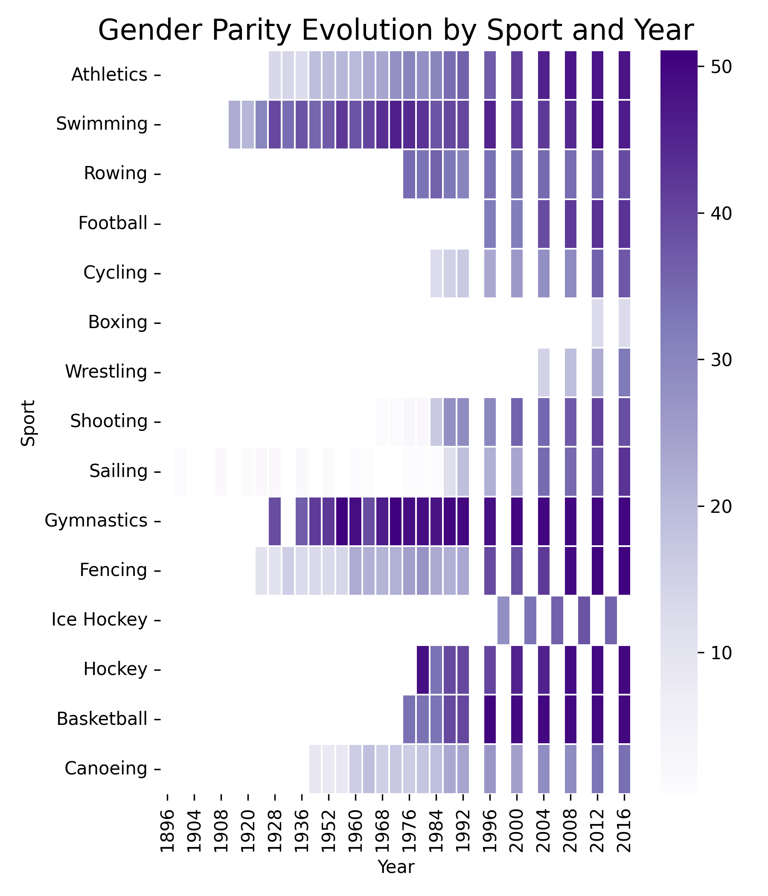

# 🏆 Analysis of Olympic data and the evolution of female participation in sports

## 📌 Executive Summary
This analysis was part of an MBA project to highlight skills learned in python and general data analysis. This excerpt reflects my personal contribution to a collaborative project

---

## 🎨 Analytical Visuals Preview
Below is a preview of a seaborn and matplotlib visuals



---

## 🏃‍♀️ Key Learnings
* **Spikes in Participation**: Spikes in participation can be seen occurring immediately following historical events such as Title IX being established in the United States
* **Gender Parity is Sport Specific**: Some sports still see an extremely low volume of women participation relative to their overall athlete makeup, such as boxing. 
* **Some Countries are Leading the Way**: As of 2016, China is leading the way with a whopping 70% of their Olympic athletes being women

---

## 💻 Featured Analytics Code

### Advanced Dynamic Carrier Ranking (Python)
This block of codes generates a looping animated graphic showing the steady growth of women's participation in the Olympics over time

```python
fig, ax = plt.subplots(figsize=(11,6))
plt.close(fig)

ax.set_xlim(female_pct['Year'].min(), female_pct['Year'].max())
ax.set_ylim(0, female_pct['Female_Percent'].max() + 5)

ax.set_xlabel("Year", fontsize=12)
ax.set_ylabel("Percent Female Participation", fontsize=12)
ax.set_title("From Exclusion to Inclusion: Women in the Olympic Games",fontsize=14, fontweight='bold')

# Add vertical reference lines
ax.axvline(1900, linestyle='--', color='pink', alpha=0.6)
ax.axvline(1924, linestyle='--', color='pink', alpha=0.6)
ax.axvline(1972, linestyle='--', color='pink', alpha=0.6)

# Add annotations
ax.text(1900, 2,"1900:\nWomen First Allowed to Compete in Summer games",fontsize=10,verticalalignment='bottom')
ax.text(1924, 12,"1924:\nWomen Allowed to Compete in Winter Games",fontsize=10,verticalalignment='bottom')
ax.text(1972, female_pct['Female_Percent'].max() * 0.5,"1972:\nTitle IX Passed\n(U.S. Surge in Women's Sports)",fontsize=10,verticalalignment='bottom')

line, = ax.plot([], [], color="#e622ab", linewidth=3)

# This combined with FuncAnimation() is what essentially created the "drawing" animation as the line is lengthened for each Olympic year and a new data point is added
def update(frame):
    x = female_pct['Year'][:frame]
    y = female_pct['Female_Percent'][:frame]
    line.set_data(x, y)
    return line,

ani = FuncAnimation(
    fig,
    update,
    frames=len(female_pct),
    interval=250,
    repeat=False
)

HTML(ani.to_jshtml())
```
